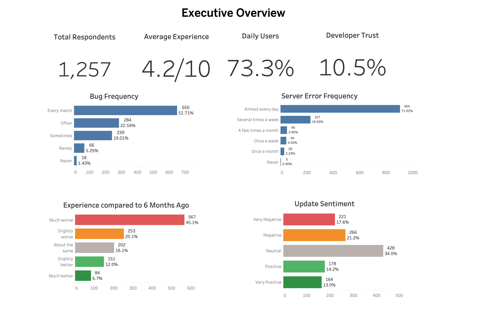
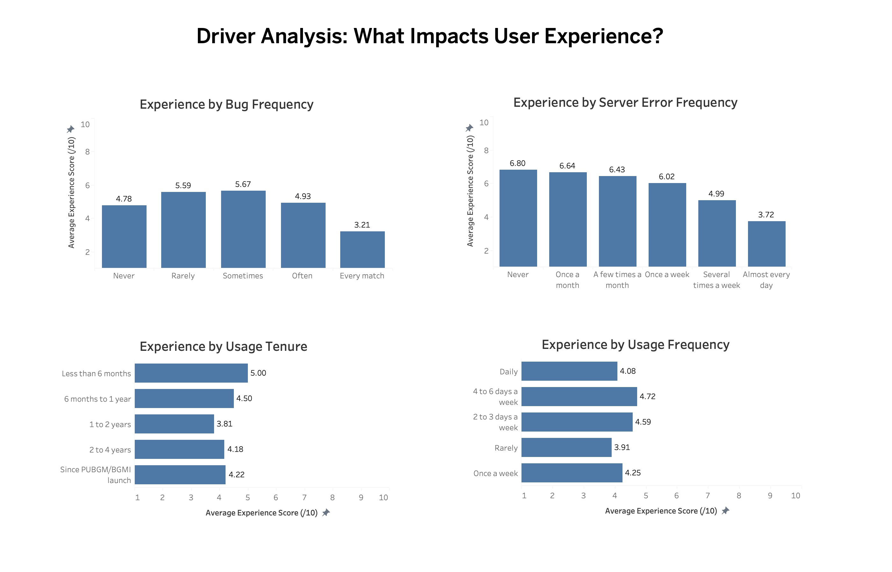
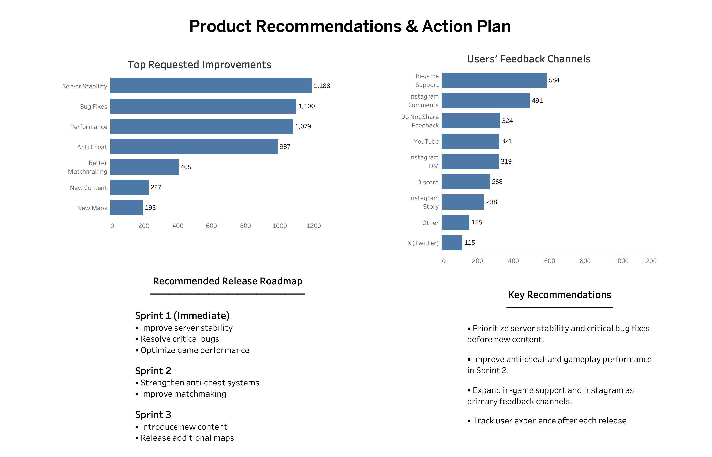

# Product Analytics Case Study: Identifying the Drivers of User Satisfaction in a Consumer Mobile Application

*A mixed-methods product analytics case study.*

**Tech stack:** Python · PostgreSQL · SQL · Tableau

> **Key outcome:** Identified technical reliability as the product area most strongly associated with lower user satisfaction by combining evidence from 1,257 survey responses and 50 qualitative interviews, then used those findings to prioritize product improvements.

---

## Executive Summary

Product teams continuously balance delivering new features with improving product reliability. While new functionality attracts users, unresolved technical issues can gradually reduce satisfaction and trust.

For this project, I designed and distributed a user survey, collected **1,257 responses**, conducted **50 semi-structured interviews**, and analyzed the results to understand which factors were most strongly associated with lower user satisfaction.

The project covers the full analytics workflow, from primary data collection and cleaning through SQL analysis, dashboard development, and product recommendations using Python, PostgreSQL, SQL, and Tableau.

The analysis found that technical reliability was more strongly associated with lower user satisfaction than requests for additional features. Across both quantitative and qualitative research, users prioritized server stability, bug resolution, and performance over new content.

---

## Business Problem

Product teams receive feedback from many different sources, but identifying recurring patterns and deciding what to prioritize is difficult. Technical issues, feature requests, and user expectations often compete for the same engineering resources.

The goal of this project was to identify which factors were most strongly associated with lower user satisfaction and use that evidence to prioritize future product improvements.

### Research Questions

- Which product factors are associated with lower user satisfaction?
- Which technical issues appear to have the greatest impact on perceived experience?
- Which improvements should product teams prioritize based on user evidence?

---

## Why This Product

The application selected for this study has a large, highly engaged user base and receives frequent product updates, making it an appropriate setting for studying user satisfaction, product reliability, developer trust, and feature prioritization.

Although the application belongs to the gaming industry, the analytical framework is transferable to other large-scale consumer products.

---

## Research Design & Methodology 

Unlike many portfolio projects that rely on public datasets, this analysis is based on **primary research**.

I designed the survey, distributed it, collected every response, and conducted the interviews personally.

### Quantitative Research

**Survey (n = 1,257)**

The survey collected information on:

- User demographics
- Platform and usage frequency
- Product satisfaction
- Technical issues
- Developer trust
- Feature priorities
- Feedback channels

The survey primarily represents active users, with approximately **73% reporting that they use the application daily**.

### Qualitative Research

**Interviews (n = 50)**

Semi-structured interviews were conducted with both active and lapsed users. Roughly half of the interviewees had reduced or stopped regular use, providing perspectives that were underrepresented in the survey.

While the survey quantified patterns across a large group of users, the interviews helped explain why those patterns existed. Participants consistently described recurring frustrations with server stability, bugs, and application performance. Many also expressed frustration that recurring issues remained unresolved, reinforcing the quantitative findings on developer trust and product priorities.

Combining both methods allowed quantitative findings to be interpreted alongside real user experiences.

```text
Survey (1,257) + Interviews (50)
              │
              ▼
      Python (Data Cleaning)
              │
              ▼
 PostgreSQL (Data Modeling)
              │
              ▼
        SQL Analysis
              │
              ▼
     Tableau Dashboards
              │
              ▼
 Product Recommendations
```

All reported figures were checked against the underlying data before publication.

---

## Key Findings

### User-reported experience declined.

**65%** of respondents reported that their experience had worsened over the previous six months, while **45%** described the decline as significant.

### Technical reliability showed the strongest association with satisfaction.

Average experience decreased from **6.8/10** among users who never experienced server errors to **3.7/10** among those encountering them almost every day.

Users experiencing bugs every match reported the lowest average experience (**3.2/10**).

### Users consistently prioritized reliability over new features.

Across both survey responses and interviews, users ranked:

- Server stability (1,188)
- Bug fixes (1,100)
- Performance optimization (1,079)

well ahead of:

- New content (227)
- New maps (195)

### Update sentiment was generally negative.

**39%** of respondents expressed disappointment with recent updates, compared with **27%** reporting positive sentiment.

### Developer trust remained low.

Confidence in developer responsiveness and product direction was consistently low, suggesting that communication and execution both influence long-term satisfaction.

---

## Recommendations

### Immediate

- Improve server stability
- Resolve high-impact bugs
- Optimize application performance

### Medium Term

- Strengthen anti-cheat systems
- Improve matchmaking quality
- Communicate progress on reliability improvements more transparently

### Long Term

- Prioritize additional content only after reliability metrics improve
- Continue structured user research following major releases
- Monitor satisfaction trends over time

These recommendations provide a prioritization framework rather than a replacement for experimentation or product validation.

---

## Limitations

Every analysis has limitations, and documenting them is part of good analytical practice.

- The survey primarily represents active users; insights from churned users rely on a smaller interview sample.
- Findings describe associations rather than causal relationships.
- During analysis, multiple prioritization approaches were evaluated. A composite impact score was ultimately rejected because it overweighted highly prevalent issues and reduced interpretability. Final recommendations were based on transparent descriptive metrics.
- Survey responses are self-reported.
- Interview feedback suggested the original user cohort may be aging out of the product. This is presented as a hypothesis rather than a conclusion because acquisition and retention data were unavailable.

---

## Data Privacy

The original survey contained personally identifiable information, including respondent IDs, submission IDs, a contact-email field, and, in a small number of cases, email addresses entered within free-text responses.

Only the cleaned and anonymized dataset is included in this repository. Raw survey exports containing personally identifiable information are intentionally excluded.

---

## Future Work

Future extensions include:

- Longitudinal tracking of user satisfaction
- Predictive modeling of churn intent
- Sentiment analysis of open-ended responses
- A/B testing of future product improvements

---

## Tech Stack

| Category | Tools |
|-----------|-------|
| Programming | Python (Pandas) |
| Database | PostgreSQL |
| Query Language | SQL |
| Visualization | Tableau |
| Development | VS Code, Jupyter Notebook |
| Database Administration | pgAdmin 4 |
| Version Control | Git, GitHub |

---

## Repository Structure

```text
product-analytics-user-experience/

├── dashboards/
│   ├── dashboard1_executive_overview.png
│   ├── dashboard2_driver_analysis.png
│   └── dashboard3_product_recommendations.png
├── data/
│   └── processed/
│       ├── survey_cleaned_public.csv
│       └── data_summary.csv
├── docs/
│   ├── data_dictionary.md
│   └── methodology.md
├── notebooks/
│   └── data_cleaning.ipynb
├── sql/
│   ├── 00_create_table.sql
│   ├── 01_executive_kpis.sql
│   ├── 02_user_segmentation.sql
│   ├── 03_product_experience.sql
│   ├── 04_technical_issues.sql
│   ├── 05_update_sentiment.sql
│   ├── 06_feature_prioritization.sql
│   ├── 07_feedback_channels.sql
│   ├── 08_business_insights.sql
│   ├── 09_dashboard_views.sql
│   └── 10_impact_prioritization.sql
├── tableau/
│   └── product_analytics_user_experience.twbx
├── README.md
└── requirements.txt
```

---

## Dashboards

Interactive dashboards:

**Tableau Public:** https://public.tableau.com/app/profile/naveen.raj.kanagaraj/vizzes

### Executive Overview



### Driver Analysis



### Product Recommendations



---

## Skills Demonstrated

- Product Analytics
- Marketing Analytics
- Data Analytics
- Business Analytics
- SQL (PostgreSQL)
- Python (Pandas)
- Tableau
- Data Cleaning & Validation
- Exploratory Data Analysis (EDA)
- Dashboard Development
- KPI Design
- User Segmentation
- Product Prioritization
- Mixed-Methods Research
- Business Storytelling

---

## Author

**Naveen Raj Kanagaraj**

Master's Student, Marketing Analytics  
DePaul University

- [Tableau Public](https://public.tableau.com/app/profile/naveen.raj.kanagaraj/vizzes)
- [LinkedIn](https://www.linkedin.com/in/naveen-raj-kanagaraj-8234b6352/)